::: {.callout-warning}
Preliminary result. Numerical values and model components remain subject to
validation and systematic studies.
:::

## Overview

The joint fit studies the J/ψ → ωπ⁺π⁻ and J/ψ → ωK⁺K⁻ channels with a common
coupled-channel model.
Independent starting points are used to diagnose local minima and optimizer
stability.

## Optimizer diagnostic

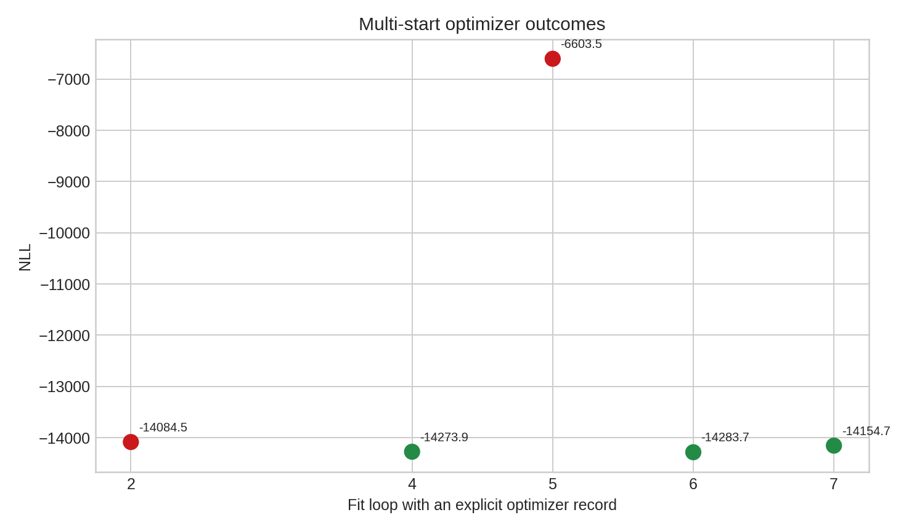{fig-alt="NLL values from reported optimizer outcomes"}

Green points denote converged optimizer records; red points denote records that
did not report convergence. The lowest reported converged solution defines the
baseline used for the projection plots below.

## Main projections

::: {.panel-tabset}
### ωπ⁺π⁻

::: {.grid}
::: {.g-col-12 .g-col-lg-4}
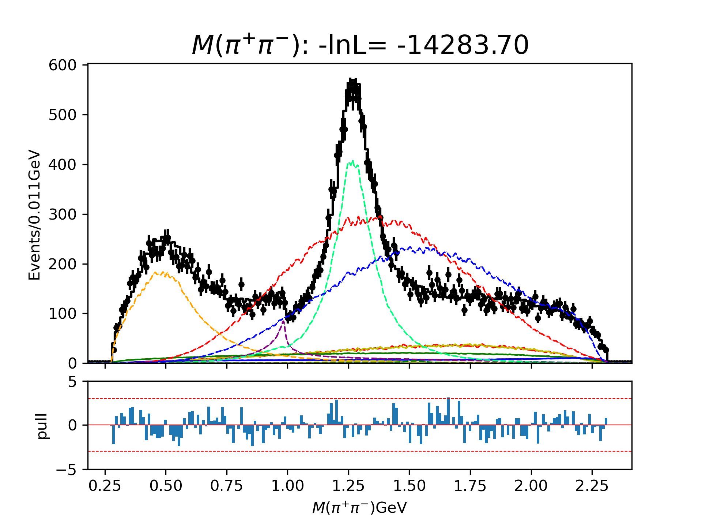{fig-alt="pi pi invariant-mass projection"}
:::
::: {.g-col-12 .g-col-lg-4}
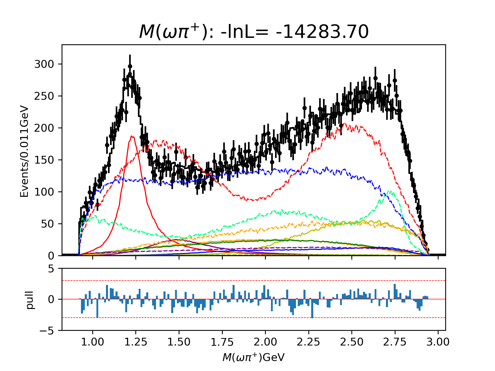{fig-alt="omega pi plus invariant-mass projection"}
:::
::: {.g-col-12 .g-col-lg-4}
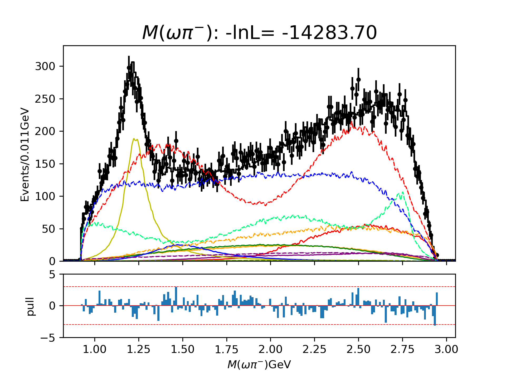{fig-alt="omega pi minus invariant-mass projection"}
:::
:::

### ωK⁺K⁻

::: {.grid}
::: {.g-col-12 .g-col-lg-4}
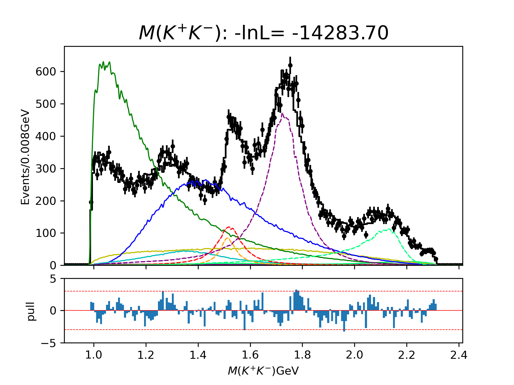{fig-alt="K K invariant-mass projection"}
:::
::: {.g-col-12 .g-col-lg-4}
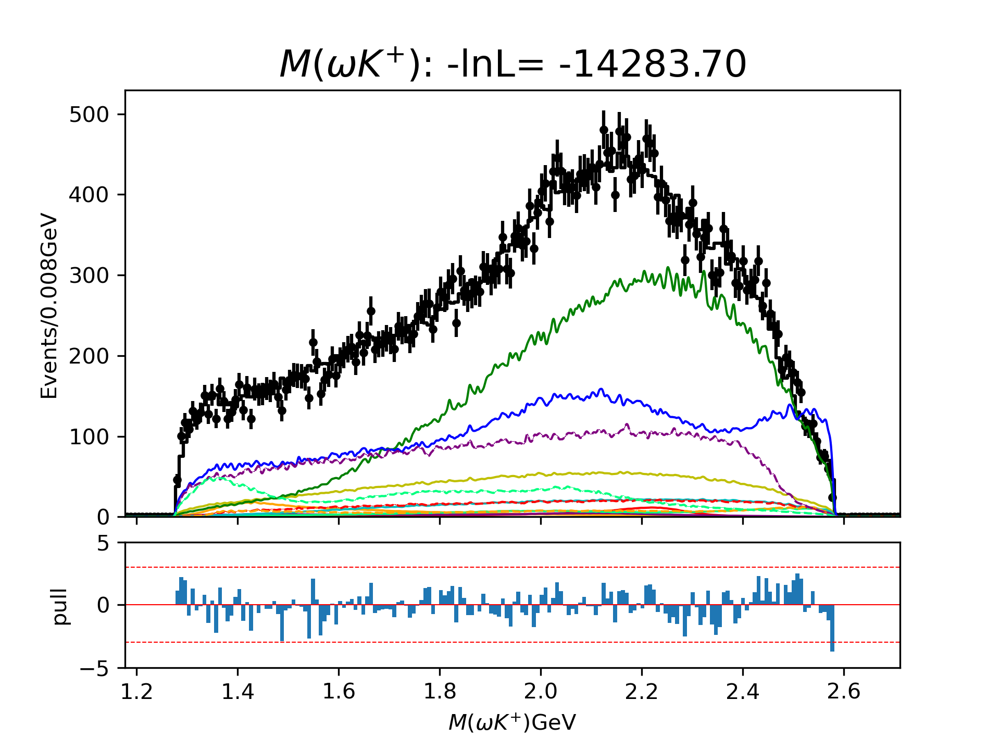{fig-alt="omega K plus invariant-mass projection"}
:::
::: {.g-col-12 .g-col-lg-4}
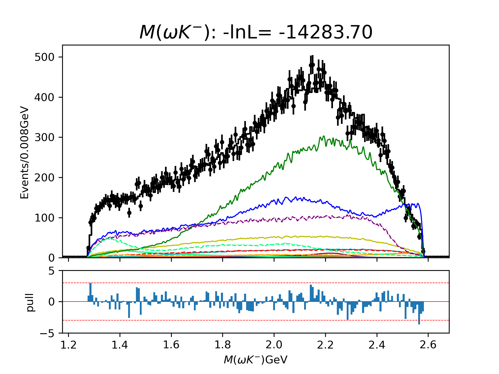{fig-alt="omega K minus invariant-mass projection"}
:::
:::
:::

## Dalitz diagnostics

### ωπ⁺π⁻

::: {.grid}
::: {.g-col-12 .g-col-lg-4}
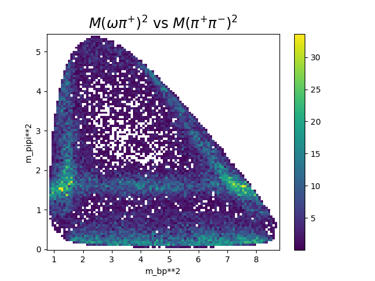{fig-alt="Channel zero Dalitz data"}
:::
::: {.g-col-12 .g-col-lg-4}
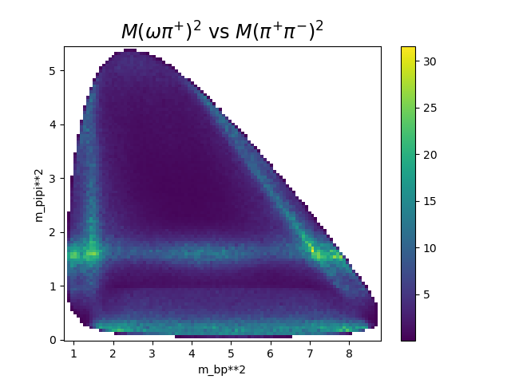{fig-alt="Channel zero fitted Dalitz distribution"}
:::
::: {.g-col-12 .g-col-lg-4}
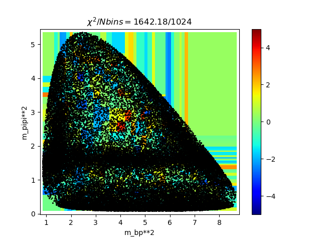{fig-alt="Channel zero Dalitz pull"}
:::
:::

### ωK⁺K⁻

::: {.grid}
::: {.g-col-12 .g-col-lg-4}
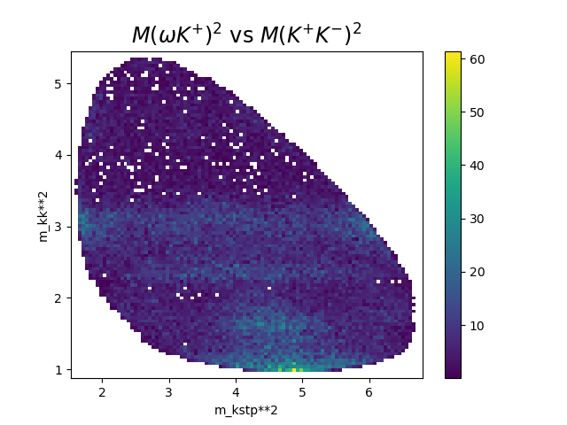{fig-alt="Channel one Dalitz data"}
:::
::: {.g-col-12 .g-col-lg-4}
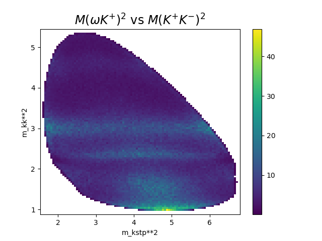{fig-alt="Channel one fitted Dalitz distribution"}
:::
::: {.g-col-12 .g-col-lg-4}
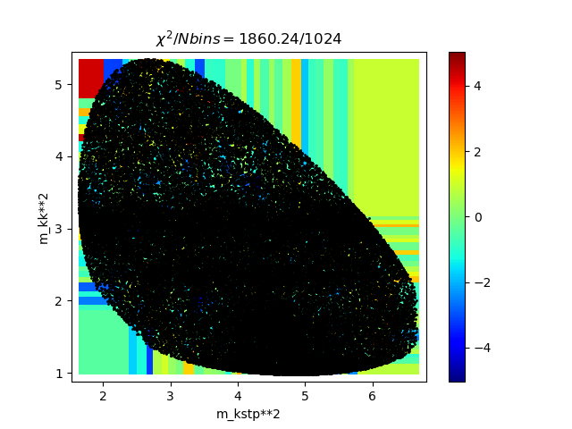{fig-alt="Channel one Dalitz pull"}
:::
:::

## Dominant diagonal fit fractions

::: {.grid}
::: {.g-col-12 .g-col-lg-6}
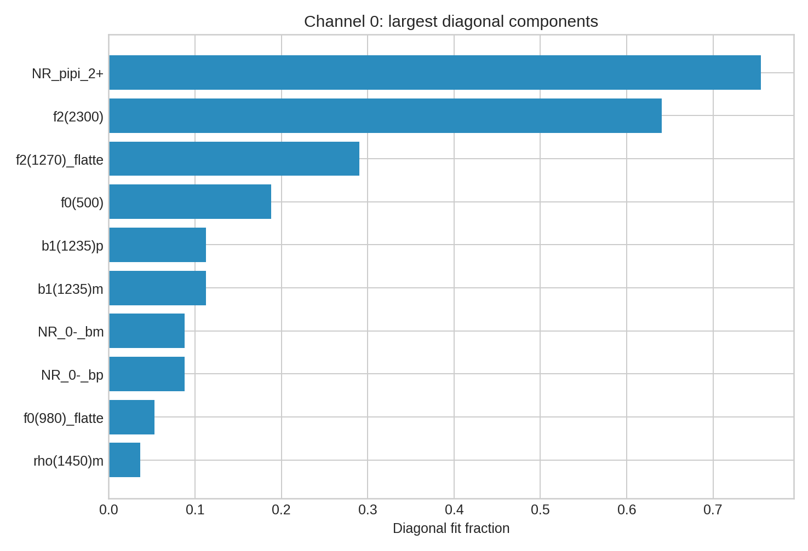{fig-alt="Largest channel zero diagonal fit fractions"}
:::
::: {.g-col-12 .g-col-lg-6}
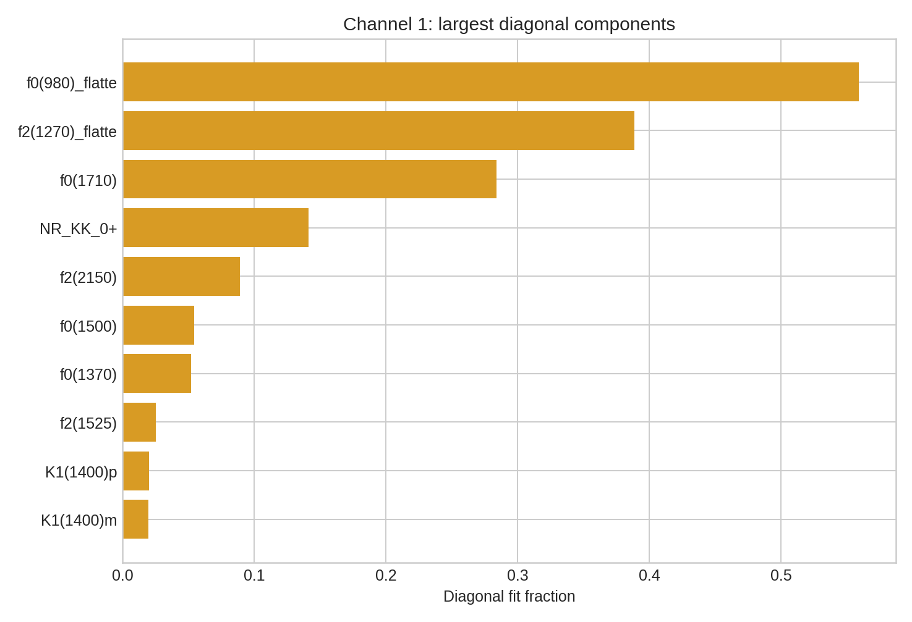{fig-alt="Largest channel one diagonal fit fractions"}
:::
:::

## Current interpretation

- The multi-start study identifies a converged baseline minimum.
- Several projection pulls retain visible structure and motivate
  distribution-by-distribution model checks.
- Fit-fraction uncertainties require further covariance and identifiability
  validation before physics interpretation.
