::: {.callout-warning}
Preliminary result. Numerical values and model components remain subject to
validation and systematic studies.
:::

## Overview

This update studies the joint J/ψ → ωπ⁺π⁻ and J/ψ → ωK⁺K⁻ fit after
initializing the GPU-enabled runtime consistently. Twenty starting points were
requested in one serial job. The run completed normally after about 25 hours.

Ten starts produced complete optimizer records: eight reported convergence and
two reported precision loss. The best explicitly converged record was start 19,
with NLL **−14273.2392**. Starts without a complete record are not shown in the
optimizer plot and still need individual follow-up.

## Optimizer and resource diagnostics

::: {.grid}
::: {.g-col-12 .g-col-lg-6}
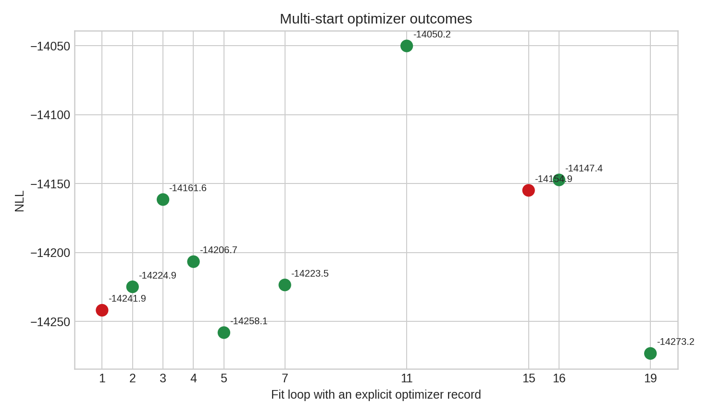{fig-alt="NLL values from complete optimizer outcomes"}

Green points denote converged optimizer records; red points denote records that
did not report convergence.
:::
::: {.g-col-12 .g-col-lg-6}
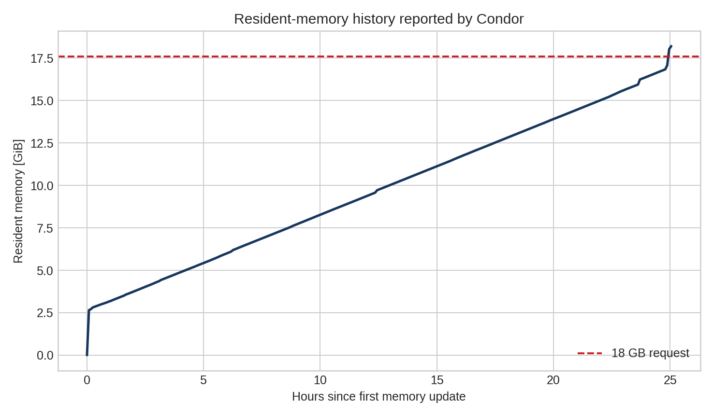{fig-alt="Resident memory growth during the serial fit"}

Resident memory grew throughout the serial process and reached approximately
18.2 GiB. Future batches should split starts into independent jobs or explicitly
release repeated fit state.
:::
:::

## Main projections

::: {.panel-tabset}
### ωπ⁺π⁻

::: {.grid}
::: {.g-col-12 .g-col-lg-4}
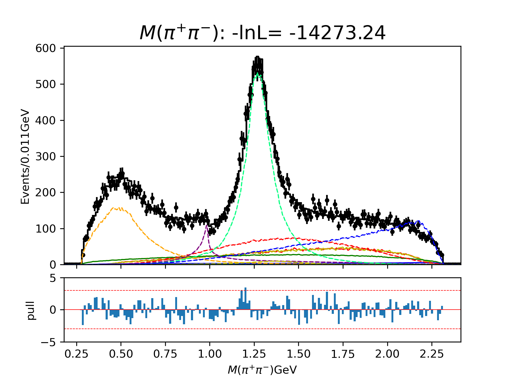{fig-alt="pi pi invariant-mass projection"}
:::
::: {.g-col-12 .g-col-lg-4}
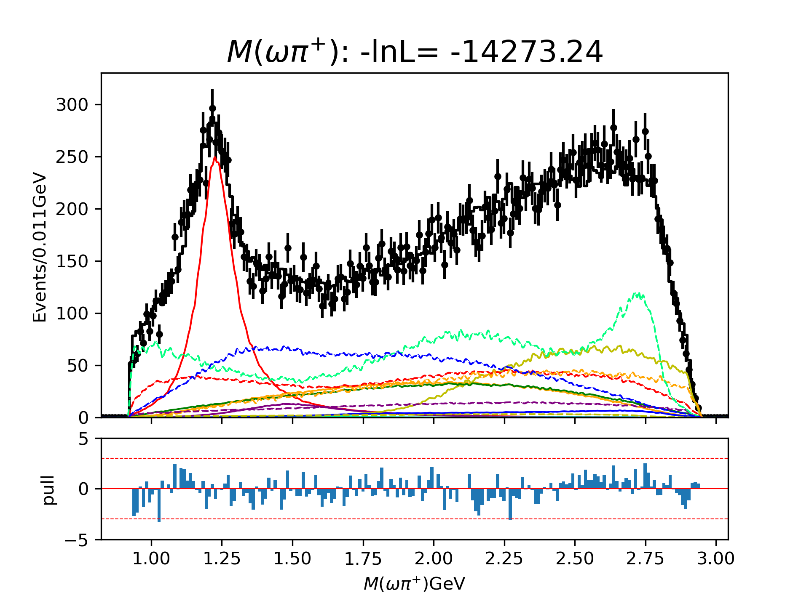{fig-alt="omega pi plus invariant-mass projection"}
:::
::: {.g-col-12 .g-col-lg-4}
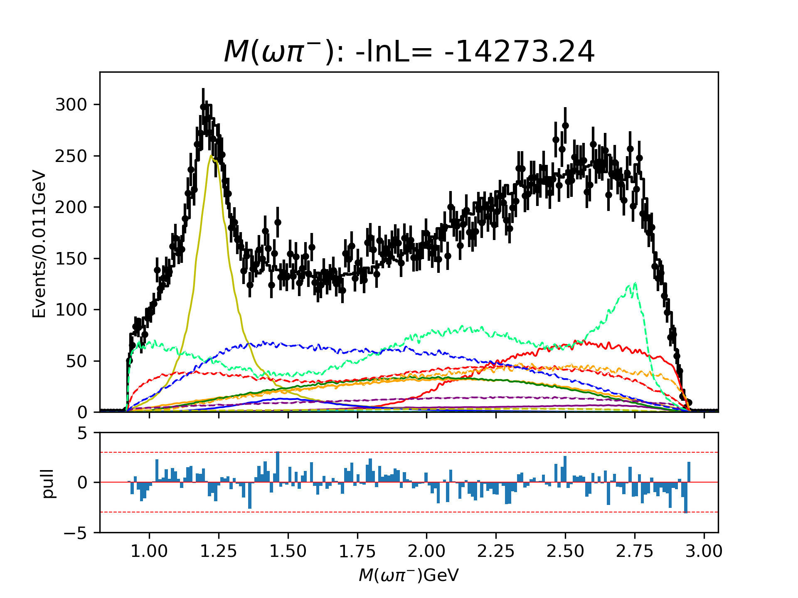{fig-alt="omega pi minus invariant-mass projection"}
:::
:::

### ωK⁺K⁻

::: {.grid}
::: {.g-col-12 .g-col-lg-4}
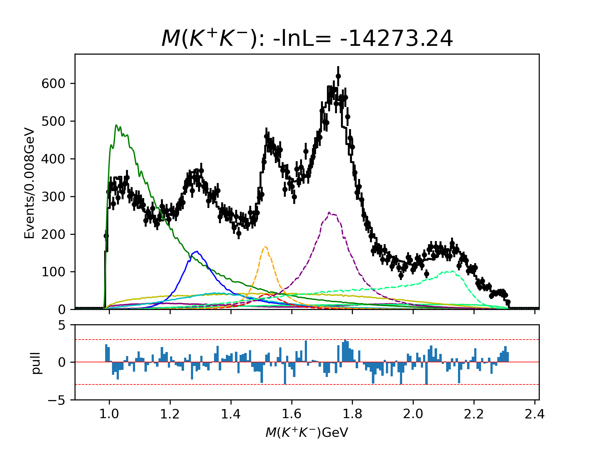{fig-alt="K K invariant-mass projection"}
:::
::: {.g-col-12 .g-col-lg-4}
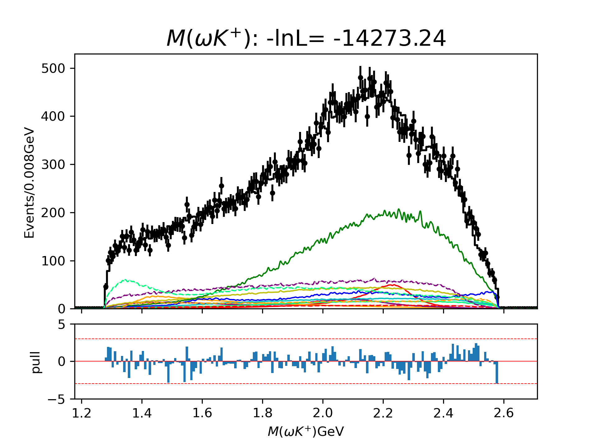{fig-alt="omega K plus invariant-mass projection"}
:::
::: {.g-col-12 .g-col-lg-4}
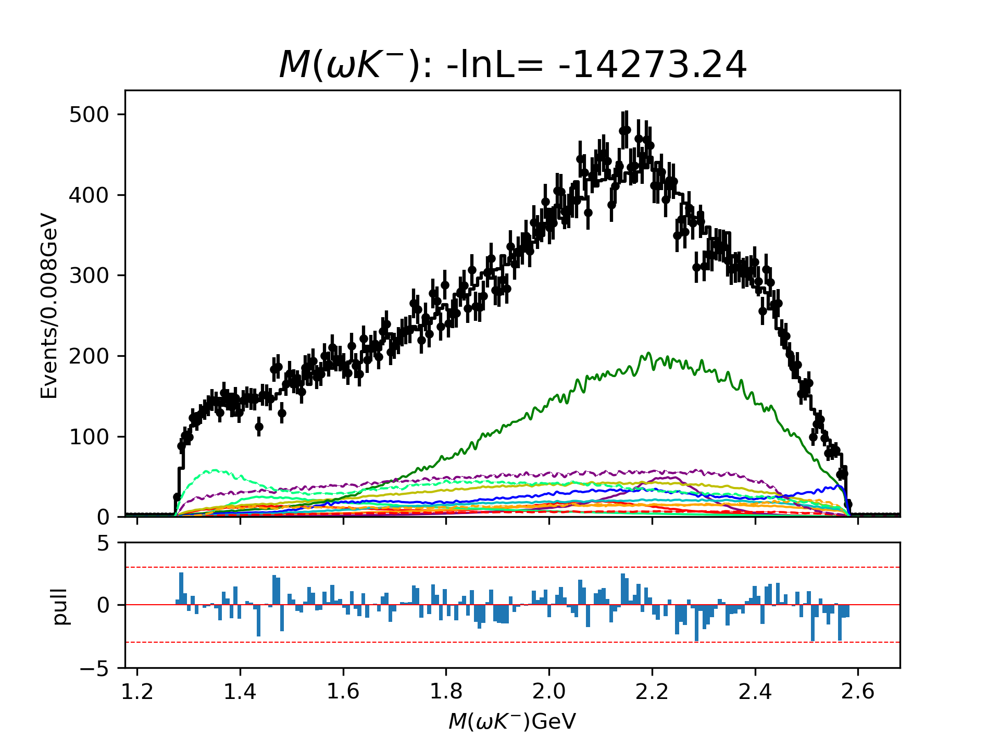{fig-alt="omega K minus invariant-mass projection"}
:::
:::
:::

## Dalitz diagnostics

### ωπ⁺π⁻

::: {.grid}
::: {.g-col-12 .g-col-lg-4}
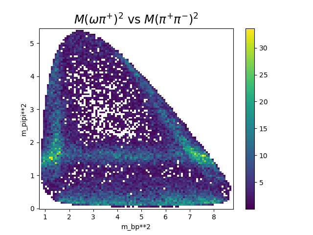{fig-alt="Channel zero Dalitz data"}
:::
::: {.g-col-12 .g-col-lg-4}
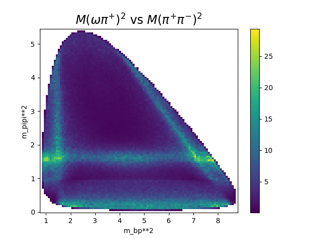{fig-alt="Channel zero fitted Dalitz distribution"}
:::
::: {.g-col-12 .g-col-lg-4}
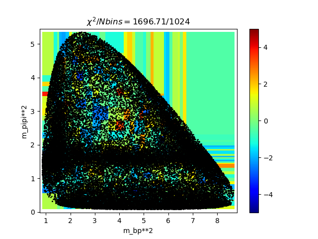{fig-alt="Channel zero Dalitz pull"}
:::
:::

### ωK⁺K⁻

::: {.grid}
::: {.g-col-12 .g-col-lg-4}
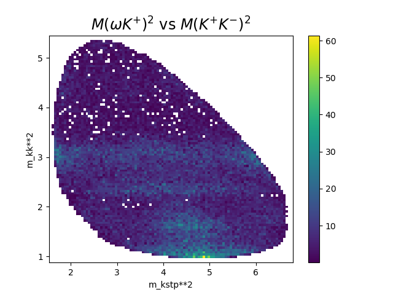{fig-alt="Channel one Dalitz data"}
:::
::: {.g-col-12 .g-col-lg-4}
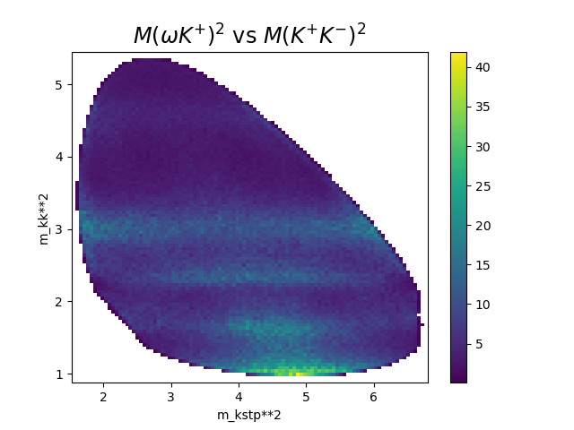{fig-alt="Channel one fitted Dalitz distribution"}
:::
::: {.g-col-12 .g-col-lg-4}
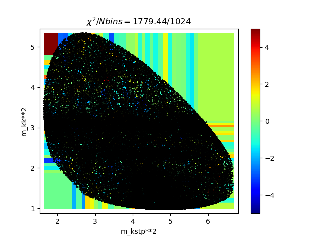{fig-alt="Channel one Dalitz pull"}
:::
:::

## Dominant diagonal fit fractions

::: {.grid}
::: {.g-col-12 .g-col-lg-6}
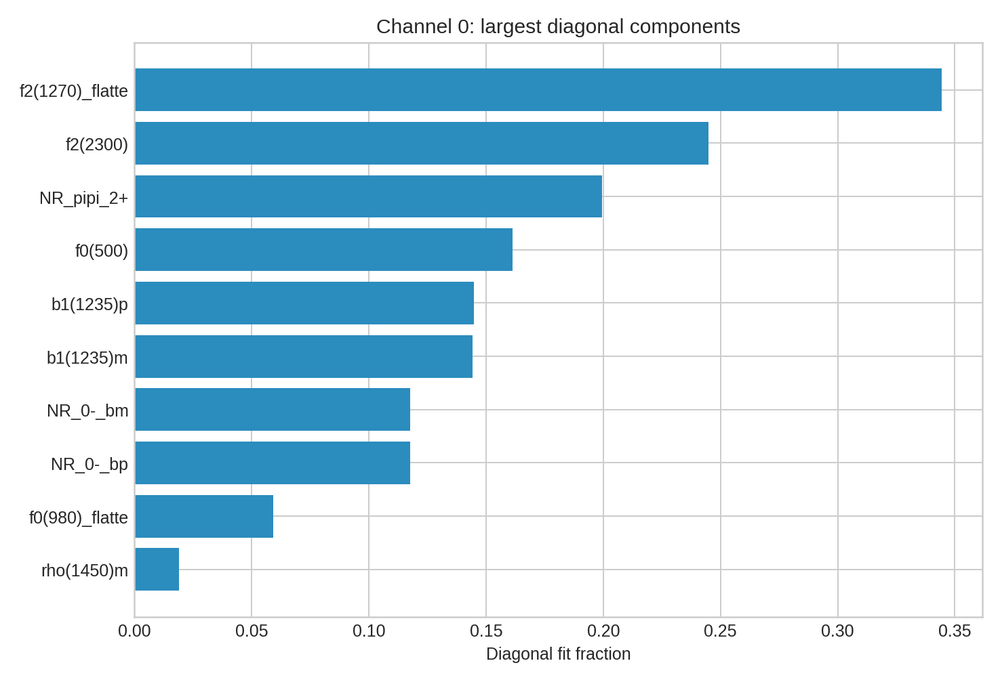{fig-alt="Largest channel zero diagonal fit fractions"}
:::
::: {.g-col-12 .g-col-lg-6}
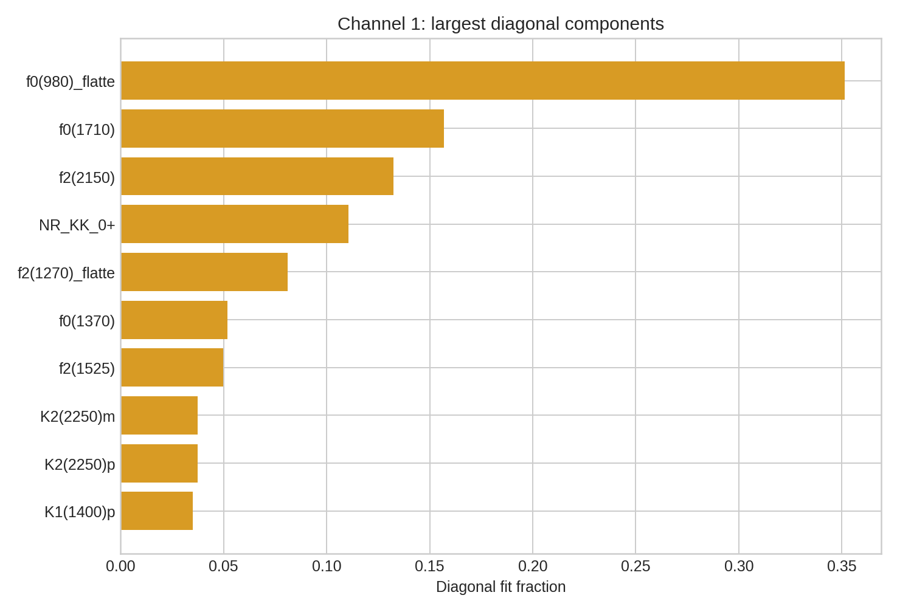{fig-alt="Largest channel one diagonal fit fractions"}
:::
:::

## Current interpretation

- The corrected GPU runtime completed the full twenty-start serial workflow.
- The spread among successful minima remains substantial, so multi-start
  selection is essential.
- Visible projection and Dalitz-pull structures should be checked one by one
  before physics interpretation.
- The monotonic memory growth is operational rather than a physics conclusion;
  independent jobs are the preferred design for the next scan.
